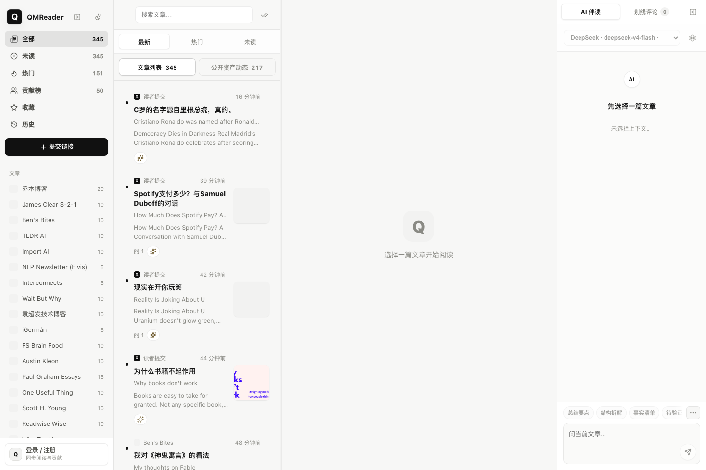
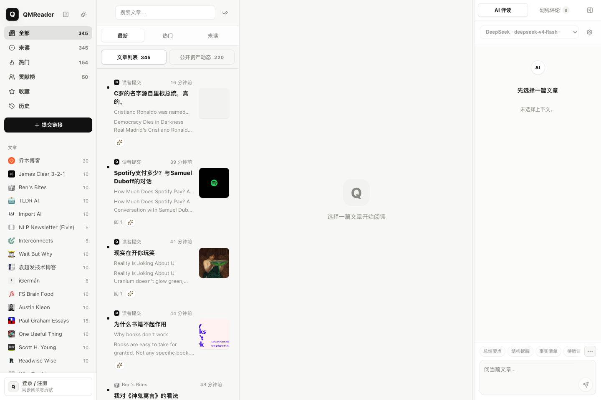
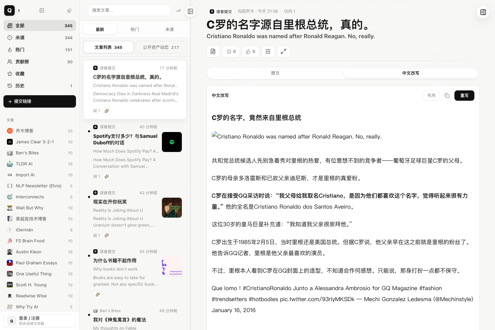

# QMReader

**中文** | [English](#english)

把 RSS 阅读、双语翻译、乔木风格改写和文章上下文 AI 对话放在一个自托管、固定单用户的阅读工作台里。

QMReader is a self-hosted, fixed-owner RSS reading workbench with bilingual titles, rewrites, and persistent reading state.

[在线体验](https://rss.qiaomu.ai) · [产品巡游](#产品巡游) · [快速开始](#快速开始) · [部署](#部署) · [API](#api) · [License](#license)



**已验证:** 2026-07-07，`node --check server.js lib/background-jobs.js lib/sources.js scripts/refresh-worker.js public/app.js`，公开站点 `https://rss.qiaomu.ai/api/sources` 返回 61 个信息源；README 截图来自正式站点 `rss.qiaomu.ai` 当前 UI。

## 这是什么

QMReader 是向阳乔木自用的 RSS 阅读器。它不是一个通用新闻门户，而是面向技术内容阅读、AI 辅助消化和公开知识资产沉淀的工作台：

- 订阅 RSSHub、直接 RSS、sitemap 和少量定制抓取源。
- 抓取后自动补英文标题中文翻译。
- 支持把文章翻译、改写成乔木风格中文稿，并长期保存在自己的阅读库中。
- 支持文章上下文 AI 对话和跨设备同步的阅读状态。
- 刷新机制把“快速 RSS 抓取”和“慢速 AI 改写”拆开，让新条目先出现，AI 后台补齐。

生产站点运行在 [rss.qiaomu.ai](https://rss.qiaomu.ai)，代码可以自托管。站点服务端需要自己的 DeepSeek 或 OpenAI-compatible API key；示例配置只包含空值，不包含任何真实密钥。

## 为什么值得用

常见 RSS 阅读器只解决“订阅和打开”。QMReader 解决的是另一个问题：每天技术内容太多，读完之后很难留下可复用资产。

它把阅读过程拆成几个可沉淀的动作：

- **先快后慢:** 新 RSS 条目先进入列表，AI 翻译和改写慢慢补齐。
- **先读后加工:** 原文、中文翻译、乔木风格改写并排存在同一篇文章下。
- **固定单用户:** 一个 owner 账号控制全部内容；收藏、已读和历史状态存入 SQLite，跨设备同步。
- **可安全自托管:** 用 HTTPS 反向代理部署到服务器，阅读内容、图片和 API 均需要登录。

## 产品巡游

### 首页和文章列表

左侧是信息源与阅读视图，中央是可搜索、可按最新/热门/未读切换的文章列表，右侧保留当前文章上下文的 AI 伴读区。未选择文章时，界面保持轻量，不把 AI 对话或调试状态推到阅读前面。



### 阅读器、中文改写和 AI 伴读

文章详情页把原文、中文改写、中文翻译、划线点评、人工点评和 AI 伴读放在同一条阅读链路中。下面这张图来自正式站点的真实文章深链，左边仍保留列表上下文，中间展示中文改写，右边是 Article Agent。



### 私人资产

QMReader 会把可复用内容沉淀为私人资产，而不是只留在浏览器会话里：

- 翻译和改写有稳定深链。
- 人工点评、划线点评、文章对话可被单条引用。
- 收藏、已读和历史由服务端 SQLite 保存，换设备后继续阅读。
- 所有资产页面、RSS 与媒体文件均在登录保护之后，不会被公网匿名访问。

### 管理和刷新

后台刷新分成 fetch worker 和 AI worker。fetch worker 只负责把最新 RSS 先抓回来并落盘，AI worker 再按有新条目的源补标题翻译和自动改写。这样即使 DeepSeek 或其他模型变慢，读者也可以先看到新文章。

## 核心能力

| 能力 | 用户得到什么 |
|---|---|
| 多源 RSS 抓取 | 聚合 RSSHub、直接 RSS、sitemap、Hacker News、Product Hunt、GitHub Trending、Hugging Face Papers 等技术源 |
| 首页工作台 | 源列表、文章列表、阅读器、Article Agent 四区同屏，适合连续阅读和快速切换上下文 |
| 文章列表 | 支持最新、热门、未读、搜索、源筛选、收藏、历史和贡献榜视图 |
| 双语阅读 | 英文标题自动补中文，正文可生成中文译文，并保留原文上下文 |
| 乔木风格改写 | 对文章、论文、Hacker News 讨论、Product Hunt 官网材料做中文改写 |
| Hacker News 增强 | 使用 HNRSS 组合高价值 HN feed，并把讨论摘录和作者回复纳入阅读材料 |
| 持久阅读状态 | 收藏、已读和阅读历史写入 SQLite，同一 owner 的所有设备保持一致 |
| 固定单用户鉴权 | 无注册、无访客；密码 scrypt 哈希，HttpOnly Session Cookie 保护所有内容与 API |
| AI 伴读 | 当前文章右侧可做总结要点、结构拆解、事实清单、待验证点等上下文对话 |
| 快速刷新 | RSS fetch 先落盘并通知 Web 进程，标题翻译和自动改写后置到 AI worker |
| 安全的用户 AI 配置 | API key 由服务器加密写入 SQLite，浏览器只使用配置 ID，多设备共享 |
| 自托管部署 | 支持 Node + systemd，也支持 Docker Compose；SQLite 存储运行数据 |

## 快速开始

```bash
# Node 24 LTS recommended (minimum Node 22.13.0)
npm install
cp .env.example .env
# Set OWNER_USERNAME, a 12+ character OWNER_PASSWORD, and APP_ENCRYPTION_KEY in .env
npm start
```

默认监听 `http://localhost:8080`。如果只想本地监听：

```bash
HOST=127.0.0.1 PORT=3000 npm start
```

首次启动会按 `STARTUP_REFRESH_DELAY_MS` 决定是否触发全量刷新。运行数据写入 `data/`，包括 RSS 缓存、SQLite 数据库、截图和日志；这些文件默认被 `.gitignore` 排除。

## 配置

`.env.example` 只给变量名和公开默认值，不包含真实密钥。常用变量：

| 变量 | 默认值 | 说明 |
|---|---|---|
| `APP_ENCRYPTION_KEY` | 无 | 界面 AI 配置的 32 字节加密主密钥；可用 `openssl rand -base64 32` 生成 |
| `DEEPSEEK_API_KEY` | 空 | 服务端 DeepSeek API key，用于标题翻译和默认改写 |
| `DEEPSEEK_MODEL` | `deepseek-v4-flash` | 服务端默认标题翻译和中文改写模型 |
| `DEEPSEEK_BASE_URL` | `https://api.deepseek.com/v1` | DeepSeek OpenAI-compatible API 地址 |
| `AI_PROVIDER` | `deepseek` | 备用服务端 provider 名称 |
| `AI_API_KEY` | 空 | 非 DeepSeek provider 的服务端 key |
| `AI_BASE_URL` | 空 | 非 DeepSeek provider 的 OpenAI/Anthropic-compatible base URL |
| `AI_MODEL` | 空 | 非 DeepSeek provider 的模型名 |
| `GEMINI_API_KEY` | 空 | Google AI Studio Gemini key（英文正文一键译简中等） |
| `GEMINI_MODEL` | `gemini-3.5-flash-lite` | Gemini 默认模型 |
| `GEMINI_BASE_URL` | `https://generativelanguage.googleapis.com/v1beta/openai` | Gemini OpenAI-compatible API 地址 |
| `OWNER_USERNAME` | 无 | 固定 owner 用户名，3–64 位小写字母、数字、点、下划线或连字符 |
| `OWNER_PASSWORD` | 无 | 固定 owner 密码，至少 12 位；首次启动写入 scrypt 哈希，改动后吊销旧 Session |
| `OWNER_DISPLAY_NAME` | `Owner` | owner 的显示名 |
| `AUTH_COOKIE_SECURE` | 自动 | HTTPS 生产环境设为 `1`；仅本机 HTTP 调试时设为 `0` |
| `HOST` | `127.0.0.1` | 裸 Node 默认监听环回；Docker Compose 在容器内覆盖为 `0.0.0.0`，宿主机仍只暴露回环端口 |
| `PORT` | `8080` | Node 监听端口 |
| `STARTUP_REFRESH_DELAY_MS` | `30000` | 启动后延迟多少毫秒触发首次全量刷新；`-1` 表示禁用 |
| `FRESHNESS_SWEEP_INTERVAL_MS` | `300000` | 轻量增量检查轮询间隔 |
| `FRESHNESS_STARTUP_DELAY_MS` | `120000` | 启动多久后开始第一次轻量增量检查 |
| `FRESHNESS_SWEEP_BATCH_SIZE` | `3` | 每次 freshness sweep 最多刷新几个过期源 |
| `FRESHNESS_SWEEP_MAX_COST` | `6` | 每次 freshness sweep 的源成本上限 |
| `NEWS_REFRESH_INTERVAL_MS` | `1800000` | `news` 分类源默认检查间隔 |
| `ARTICLE_REFRESH_INTERVAL_MS` | `7200000` | `article` 分类源默认检查间隔 |
| `PODCAST_REFRESH_INTERVAL_MS` | `21600000` | `podcast` 分类源默认检查间隔 |
| `SOURCE_INTERACTION_REFRESH_COOLDOWN_MS` | `300000` | 打开文章或切换频道触发后台刷新时的同源冷却时间 |
| `ZHIHU_RELOAD_POLL_MS` | `300000` | 知乎 localOnly：外部 crawl 写 stamp 后 Reader 轮询重读 DB；`0` 关闭 |
| `ZHIHU_ZEN_PROFILE` | 空 | 知乎导出用 Zen profile 路径覆盖 |
| `ZHIHU_EXPORT_PATH` / `ZHIHU_IMPORT_STAMP` | 空 | 知乎自动导出路径与导入 stamp；见 `.env.example` |
| `ZHIHU_CRAWL_ENABLED` | 空 | 设为 `0` 跳过知乎自动 crawl（launchd / npm 脚本） |
| `BILI_ZEN_PROFILE` / `BILI_COOKIE` | 空 | B站收藏同步：Zen profile 或直接 SESSDATA |
| `BILI_POLL_MS` | `300000` | B站收藏轮询间隔 |
| `BILI_SYNC_ENABLED` | `1` | 设为 `0` 关闭 B站收藏自动同步 |
| `FETCH_SOURCE_CONCURRENCY` | `6` | 批量刷新时并发抓取的信息源数量，范围 1–8 |
| `TITLE_TRANSLATION_LIMIT` | `80` | 单轮标题翻译上限 |
| `AUTO_REWRITE_SOURCE_IDS` | 空 | 限定自动改写源；空值表示启用源中可改写的内容 |
| `AUTO_REWRITE_LIMIT_PER_SOURCE` | `3` | 每个源默认自动改写条数 |
| `AUTO_REWRITE_LIMIT_HACKERNEWS` | `10` | Hacker News 自动改写条数 |
| `AUTO_REWRITE_MODEL` | `deepseek-v4-flash` | 自动改写模型 |
| `UMAMI_WEBSITE_ID` | 空 | 可选 Umami 站点 ID |
| `UMAMI_SRC` | `https://umami.qiaomu.ai/script.js` | 可选 Umami 脚本地址 |

本机 Zen 相关源（知乎 / B站）的运维细节见 [README.zen.md](README.zen.md)。运行时 SQLite 默认为 `data/qmreader.sqlite`（勿与历史空文件混淆）。

## 运行形态

本仓库是**固定单用户阅读器**：无注册、无多用户、无匿名访问。首次启动必须配置 `OWNER_USERNAME` 和 `OWNER_PASSWORD`；所有页面、API、RSS 和本地媒体都需要 owner Session。公网部署应使用 HTTPS 反向代理，并让 Node/Docker 端口只在服务器本机可达。

## AI 与隐私边界

- 页面中保存的 AI provider/API key 使用 `APP_ENCRYPTION_KEY` 进行 AES-256-GCM 加密后写入 SQLite，不会把明文下发到浏览器。
- 浏览器只向本站后端发送 AI 配置 ID；文章对话、模型列表、连接测试、翻译和改写都由后端解密并调用 provider。
- `.env` 中的 `DEEPSEEK_API_KEY` / `GEMINI_API_KEY` 仅作为后台任务兼容回退，也不会下发到浏览器。
- 请分开备份 SQLite 与 `APP_ENCRYPTION_KEY`；主密钥丢失或更换后，已保存的 API key 无法解密。
- Base URL 必须是公开 `https://` 地址，服务端会拒绝本机和内网地址，降低 SSRF 风险。
- 个人精选链接在本机直接抓取入库；服务端仍拒绝内网、IP 字面量与探针路径等 SSRF 面。
- 运行数据在 `data/qmreader.sqlite` 和 `data/cache.json`，默认不提交到 Git。

## 刷新机制

QMReader 的刷新分两段：

1. **Fetch worker:** 抓 RSS/页面，写入缓存和 SQLite，并立刻通知 Web 进程重新加载。用户先看到新条目。
2. **AI worker:** 只对有新条目的源排队做标题翻译和自动改写。AI 慢或失败时，不阻塞 RSS 阅读。

不同源有不同 freshness 策略。例如 Hacker News 5 分钟高优先级，Product Hunt 15 分钟，GitHub/Hugging Face 30 分钟，播客类 12 小时。`/api/sources` 会返回 `backgroundJob.fetch` 和 `backgroundJob.ai`，便于观察两段任务状态。

命令行手动刷新：

```bash
npm run refresh:worker
node scripts/refresh-worker.js --kind=auto-rewrite --sources=hackernews
```

## 信息源

信息源在 `lib/sources.js` 里配置。示例：

```js
{
  id: 'my-source',
  name: '我的源',
  category: 'article',
  siteUrl: 'https://example.com',
  enabled: true,
  limit: 10,
  feeds: [
    'https://example.com/feed',
    '{rsshub}/some/route',
    'sitemap:https://example.com/sitemap.xml',
  ],
}
```

支持三类候选地址：

| 写法 | 说明 |
|---|---|
| 普通 URL | 直接按 RSS/Atom 解析 |
| `{rsshub}/route` | 依次尝试内置 RSSHub 实例 |
| `sitemap:URL` | 抓 sitemap.xml 取最新文章页，再解析页面 og 标签 |

## API

所有接口均需 owner 登录：

| 方法 | 路径 | 说明 |
|---|---|---|
| GET | `/api/sources` | 全部源及抓取状态、刷新进度、fetch/AI 后台状态 |
| GET | `/api/entries?source=&category=&q=&limit=` | 文章列表 |
| GET | `/api/entry/:id` | 单篇全文 |
| GET | `/api/entry/:id/translation` | 读取双语翻译缓存 |
| GET | `/api/entry/:id/rewrite` | 读取乔木风格改写 |
| GET | `/api/entry/:id/comments` | 读取公开人工点评 |
| GET | `/api/entry/:id/chat` | 读取公开文章对话 |
| POST | `/api/auth/login` | 创建 owner Session（浏览器通常使用 `/login` 页面） |
| POST | `/api/auth/logout` | 注销当前设备 Session |
| GET | `/api/me` | 当前 owner 资料 |
| GET | `/api/me/entry-states` | 读取收藏、已读和历史状态 |
| PATCH | `/api/me/entry-states/:id` | 更新单篇收藏或已读状态 |
| GET | `/assets` | 私人资产网页目录 |
| GET | `/assets.xml` | 登录保护的资产 RSS |
| GET | `/contributors` | 公开贡献者目录 |
| GET | `/contributors/:id.xml` | 贡献者公开资产 RSS |
| GET | `/llms.txt` | 站点定位、公开目录、RSS 和 sitemap 汇总 |
| POST | `/api/submit-link` | 本机收录链接到「个人精选」 |
| DELETE | `/api/entry/:id` | 本机软删条目 |
| POST | `/api/refresh` | 手动刷新源 |

没有注册、找回密码或账号切换接口。修改密码请更新服务器 `.env` 中的 `OWNER_PASSWORD` 后重启服务；所有旧 Session 会被吊销。切片挂载见 `modules/create-app.js`。

## 部署

### systemd 推荐路径

```bash
rsync -az --delete \
  --exclude node_modules \
  --exclude .git \
  --exclude data \
  --exclude .env \
  ./ user@server:/opt/qmreader/

ssh user@server 'cd /opt/qmreader && bash scripts/install-systemd-service.sh'
```

安装脚本会执行 `npm ci --omit=dev`，写入 systemd unit，并默认监听 `HOST=127.0.0.1`、`PORT=3088`。请先在 `/opt/qmreader/.env` 配置 owner 凭据，再由 Nginx/Caddy 反代 HTTPS。

常用命令：

```bash
systemctl status qmreader
journalctl -u qmreader -n 100 --no-pager
systemctl restart qmreader
```

### Docker Compose

```bash
cp .env.example .env
docker compose up -d --build
```

默认容器内端口 `8080`，宿主机私有端口 `127.0.0.1:3088`。
`./data` 保存 SQLite 与缓存，`./public/article-images` 保存下载的正文图片；两者都必须纳入服务器备份。

Caddy 示例（把域名替换为自己的解析记录）：

```caddyfile
reader.example.com {
  encode zstd gzip
  reverse_proxy 127.0.0.1:3088
}
```

反向代理必须传递原始 `Host` 和 `X-Forwarded-Proto`；Caddy 默认会正确处理。不要把容器的 `8080` 或宿主机 `3088` 直接开放到公网。

## 项目结构

```text
server.js                  Express 入口、API、调度器、静态托管
lib/sources.js             信息源注册表和刷新策略
lib/fetcher.js             RSS/RSSHub/sitemap/页面抓取和缓存
lib/background-jobs.js     后台刷新、标题翻译、自动改写 worker 逻辑
lib/deepseek.js            AI provider、翻译、改写、对话调用
lib/store.js               SQLite schema 和数据访问
public/                    静态前端
scripts/                   systemd 安装脚本和 refresh worker
ops/                       部署记录
data/                      运行时数据，默认不提交
```

## 验证

```bash
npm test
node --check server.js
node --check lib/background-jobs.js
node --check lib/deepseek.js
node --check lib/fetcher.js
node --check lib/sources.js
node --check lib/store.js
node --check scripts/refresh-worker.js
node --check public/app.js
npm run refresh:worker
```

发布前额外做过：

- tracked HEAD 文件 secret 扫描，无 API key/token/private key 命中。
- Git 历史 `git grep -l` secret 模式扫描，无命中。
- `data/`、`node_modules/`、`.env`、`.env.local` 默认被排除。
- live API `https://rss.qiaomu.ai/api/sources` 返回 61 个信息源。

## 已知限制

- 某些站点会被 Cloudflare 或反爬策略拦截，无法稳定抓取。
- AI 生成质量依赖外部 provider，可能遇到限流、模型变更或费用问题。
- 默认 SQLite 适合一个 owner 的自托管阅读库，不适合多租户或高并发写入。
- Google S2 favicon 在部分网络环境不可用，会回退到内置安全占位图标。
- GitHub social preview 暂未自动配置，需要仓库发布后在 GitHub Settings 手动上传。

## 贡献

这个项目目前首先服务向阳乔木自己的阅读工作流，也欢迎围绕 RSS 源、部署文档、隐私边界和 bug 修复提交 PR。请先阅读 [CONTRIBUTING.md](CONTRIBUTING.md) 和 [SECURITY.md](SECURITY.md)。

## 关于向阳乔木

- 官网：[qiaomu.ai](https://qiaomu.ai)
- 博客：[blog.qiaomu.ai](https://blog.qiaomu.ai)
- 推荐：[tuijian.qiaomu.ai](https://tuijian.qiaomu.ai)
- X：[@vista8](https://x.com/vista8)
- GitHub：[@joeseesun](https://github.com/joeseesun)
- 微信公众号：向阳乔木推荐看

## License

MIT License. See [LICENSE](LICENSE).

---

<a name="english"></a>

# English

QMReader is a self-hosted, fixed-owner RSS reading workbench. It combines feed aggregation, bilingual title translation, Chinese article rewriting, persistent reading state, and article-context AI conversations in one quiet reader interface.


## What You Get

- RSSHub, direct RSS, sitemap, Hacker News, Product Hunt, GitHub Trending, Hugging Face Papers, and other technical sources.
- A fast refresh pipeline: RSS fetches land first; AI translation/rewrite work runs separately in the background.
- Private reading assets and server-persisted favorites, read state, and history shared by the owner's devices.
- A static frontend served by Express, with SQLite for runtime data.
- Server-side DeepSeek/OpenAI-compatible support, plus encrypted cross-device AI profiles.

## Product Tour

### Source And Article List

The default workspace keeps source navigation, search, latest/hot/unread list modes, the reader pane, and the article agent visible at the same time.


### Reader, Chinese Rewrite, And Article Agent

The reader keeps the original article, Chinese rewrite, translation, annotations, comments, and article-context AI chat under the same entry.


### Private Assets

Translations, rewrites, comments, annotations, and article chats keep stable links and RSS feeds, but every route remains behind the fixed-owner session.

## Feature Map

| Feature | Result |
|---|---|
| Multi-source feed fetching | Aggregate RSSHub routes, direct feeds, sitemap pages, Hacker News, Product Hunt, GitHub Trending, and more |
| Reader workbench | Keep source list, article list, reader, and Article Agent in one screen |
| Bilingual reading | Translate English titles and generate Chinese article translations |
| Qiaomu-style rewrites | Rewrite articles, papers, HN discussion material, and Product Hunt product context into readable Chinese |
| Persistent reading state | Keep favorites, read state, and history in SQLite across owner devices |
| Fixed-owner authentication | Protect every page, API, RSS feed, and media file with an HttpOnly server session |
| Split refresh pipeline | Show new RSS entries first, then run AI title translation/rewrite in a separate worker |
| User AI profiles | Encrypt API keys in server-side SQLite and share profiles across owner devices |
| Self-hosting | Run with Node/systemd or Docker Compose; store runtime data in SQLite |

## Try It

Live demo: [rss.qiaomu.ai](https://rss.qiaomu.ai)

```bash
# Node 24 LTS recommended (minimum Node 22.13.0)
npm install
cp .env.example .env
# Set OWNER_USERNAME, a 12+ character OWNER_PASSWORD, and APP_ENCRYPTION_KEY in .env
npm start
```

Open `http://localhost:8080`.

To run locally only:

```bash
HOST=127.0.0.1 PORT=3000 npm start
```

## Configuration

Copy `.env.example` to `.env` and fill in your own keys. The repository does not contain production API keys.

Important variables (full Chinese table above):

- `DEEPSEEK_API_KEY` / `GEMINI_API_KEY`: server-side keys for translation and rewriting.
- `DEEPSEEK_MODEL` / `GEMINI_MODEL`: default models.
- `OWNER_USERNAME` / `OWNER_PASSWORD`: the fixed owner credentials; the password must be at least 12 characters.
- `APP_ENCRYPTION_KEY`: 32-byte key used to encrypt UI-managed AI credentials in SQLite.
- `HOST` / `PORT`: HTTP bind address and port. Keep the host port private behind the HTTPS reverse proxy.
- `STARTUP_REFRESH_DELAY_MS`: startup refresh delay, or `-1` to disable.
- `FRESHNESS_SWEEP_INTERVAL_MS`: stale-source sweep interval.
- `AUTO_REWRITE_SOURCE_IDS`: optional source allowlist for auto rewriting.
- `BILI_*` / `ZHIHU_*`: optional local-only sync (see Chinese table and `README.zen.md`).

Runtime DB defaults to `data/qmreader.sqlite` under `data/` (Git-ignored).

## Privacy And Security

- UI-managed AI keys are encrypted with `APP_ENCRYPTION_KEY` and stored in SQLite; plaintext keys are never returned to browsers.
- Environment provider keys remain available as optional background-job fallbacks.
- All reader pages, APIs, RSS feeds, and local media require the fixed owner session.
- AI base URLs must be public HTTPS URLs; localhost and private network addresses are rejected.
- Report vulnerabilities through the process in [SECURITY.md](SECURITY.md).

## Deployment

Recommended production shape:

1. Configure `OWNER_USERNAME` and `OWNER_PASSWORD` in the server-only `.env` file.
2. Run Node on a private host/port, for example `127.0.0.1:3088`.
3. Put Nginx or Caddy in front for HTTPS.
4. Back up `data/`, `public/article-images/`, and `APP_ENCRYPTION_KEY` separately.

```bash
rsync -az --delete \
  --exclude node_modules \
  --exclude .git \
  --exclude data \
  --exclude .env \
  ./ user@server:/opt/qmreader/

ssh user@server 'cd /opt/qmreader && bash scripts/install-systemd-service.sh'
```

Docker Compose is also available:

```bash
cp .env.example .env
docker compose up -d --build
```

## Verification

```bash
node --check server.js
node --check lib/background-jobs.js
node --check lib/sources.js
node --check scripts/refresh-worker.js
node --check public/app.js
```

Before public release, tracked files and Git history were scanned for common API key/token/private key patterns. No matches were found.

## Limits

- External websites may block scraping.
- AI output depends on your provider, quota, and model behavior.
- SQLite is intended for small self-hosted use, not a large multi-tenant SaaS.
- There is no registration, password recovery, or multi-user mode; change the owner password through the server environment and restart.
- The GitHub social preview image is a manual follow-up after publication.

## Maintainer

Maintained by 向阳乔木:

- [qiaomu.ai](https://qiaomu.ai)
- [blog.qiaomu.ai](https://blog.qiaomu.ai)
- [tuijian.qiaomu.ai](https://tuijian.qiaomu.ai)
- X [@vista8](https://x.com/vista8)
- GitHub [@joeseesun](https://github.com/joeseesun)

MIT License.
